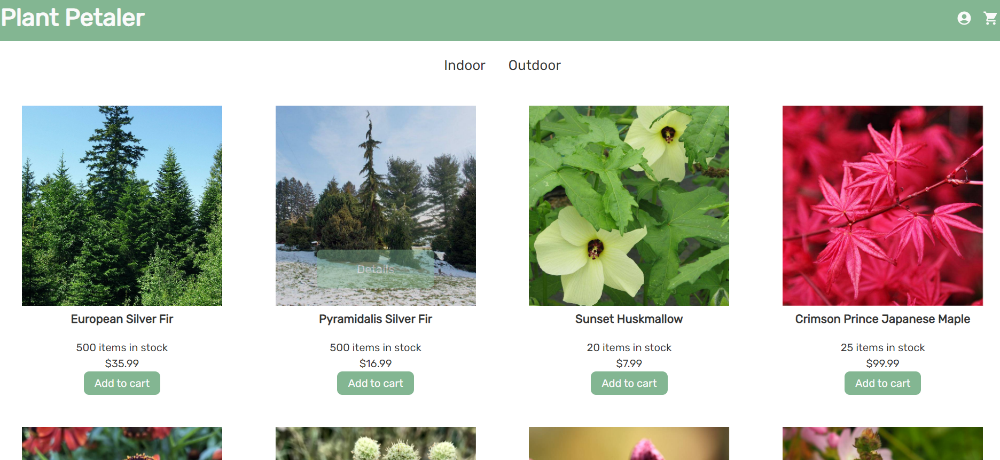

# Plant-Petaler

## Description
We built a scalable, user-focused MERN app that enables plant lovers to shop online for indoor and outdoor plants. We combined a scalable MongoDB back end, a GraphQL API, and an Express.js and Node.js server with a React front end, implementing user authentication with JWT to build a user-focused platform. In addition, we integrated the Stripe payment platform for a safe and easy checkout experience. 

## Table of Contents
- [Description](#description)
- [Installation](#installation)
- [Usage](#usage)
- [Contributing](#contributing)
- [Questions](#questions)

## Installation
To invoke our application, use the following commands:

npm install
npm start

## Usage
As a plant lover, I want to be able to shop for plants online so that I can shop a wider variety of plants on the schedule that works for me and have my plants shipped to my doorstep. 
This application is being hosted on [Heroku](https://plant-petaler.herokuapp.com/). 

## Contributing
Thank you for your interest in our project. We are excited to see your contributions. Please follow the [Contributor Covenant](https://www.contributor-covenant.org/).

## Questions
If you have any questions, please open an issue in GitHub or email a group member.
[mxwsic](https://github.com/Mxwsic)!
[tbgolfer86](https://github.com/tbgolfer86)!
[cellopudding](https://github.com/cellopudding)!
[laurszalk](https://github.com/laurszalk)!
[bsimmonds28](https://github.com/bsimmonds28)!
